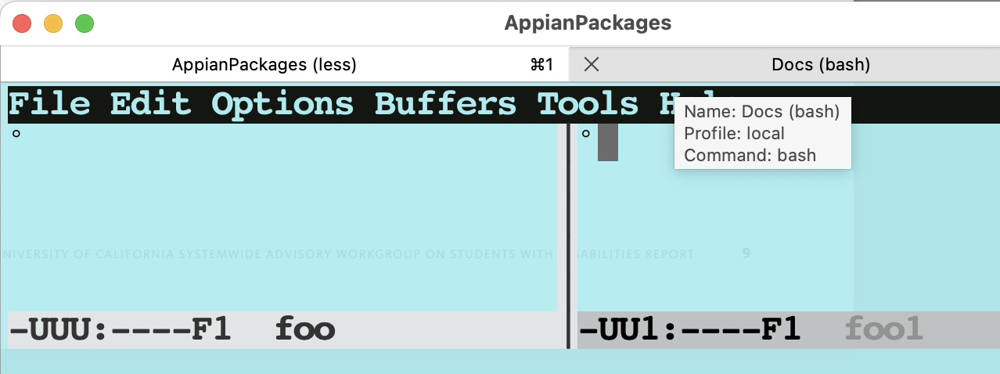

# Character Encoding

Text files can have different character encodings. And knowing what the encoding is
and how to handle it can be important.

Consider the file `../Data/USA_CA_Bodega.Bay.CG.Light.Station.724995_TMYx.stat`.
We can read its contents into R with
```{r}
f = "../Data/USA_CA_Bodega.Bay.CG.Light.Station.724995_TMYx.stat"
ll = readLines(f)
```

Now we want to read tables contained within this file.
Let's search for the line(s) that contain the string `Monthly Statistics for Dry Bulb temperatures`
```
i = grep("Monthly Statistics for Dry Bulb temperatures", ll)
```
The call is successful bug also raises 22 warnings.
We can view these by calling `warnings()` and we see 
```
Warning messages:
1: In grep("Monthly Statistics for Dry Bulb temperatures",  ... :
  unable to translate '      {N 38<b0> 18.72'} {W 123<b0> 3.10'} {GMT -8.0 Hours}' to a wide string
2: In grep("Monthly Statistics for Dry Bulb temperatures",  ... :
  input string 4 is invalid
....
```

The `N 38<b0> 18.72` corresponds to `N 38° 18.72'` in line 4.
The `<b0>` corresponds to the ° symbol.

Let's repeat these computations but read the file slightly differently:
```{r}
ll = readLines(f, encoding = "latin1")
i = grep("Monthly Statistics for Dry Bulb temperatures", ll)
```
We get the same answer from `grep()` (line 49) but no warnings.
Importantly, we changed the call to `readLines()` to tell R that
the character encoding for this file is latin1 (or ISO-8859-1).
This tells readLines() how to interpret the bytes and map them to a specific character set, 
specifically the latin-1 character set.

Let's look at line 4 when we read the file using both approaches
```
a = readLines(f)[4]
b = readLines(f, encoding = "latin1")[4]
```
```
[1] "      {N 38\xb0 18.72'} {W 123\xb0 3.10'} {GMT -8.0 Hours}"
[1] "      {N 38° 18.72'} {W 123° 3.10'} {GMT -8.0 Hours}"
```

We see `\xbo` in the first string and this corresponds to the `<b0>` in the warning message.
There is a lot going on here in terms of interpreting the bytes in the file and then also displaying
them in the console. 

The important message is that you should know the encoding of the characters for a file
and should specify this when reading a file in R (or other programming languages.)
When characters are displayed unusually or functions give warning messages about strings, consider
the encoding.

We can query the actual/current encoding of elements in a character vector with `Encoding()`, e.g.,
```
Encoding(a)
Encoding(b)
Encoding(c(a, b))
```
which yields
```
[1] "unknown"
[1] "latin1"
[1] "unknown" "latin1" 
```

We can convert the first string (in `a`) to UTF-8 (Unicode Transformation Format – 8-bit) via
```{r}
a2 = iconv(a,  "LATIN1", "UTF-8")
```
```
[1] "      {N 38° 18.72'} {W 123° 3.10'} {GMT -8.0 Hours}"
```
And this now has an encoding of UTF-8:
```{r}
Encoding(a2)
```
```
[1] "UTF-8"
```


## More Investigation & Details

I have 2 files - foo and foo1.
When I open them both in my text editor (emacs), they appear to be the same



However, they are different.
We can see this in various ways - from within R or the terminal:

+ The files have a different  number of bytes:

```
file.info(c("foo", "foo1"))$size
```
```
[1] 4 3
```

+ The raw contents are different

```
rw = lapply(c("foo", "foo1"), function(f)  readBin(f, "raw", file.info(f)$size))
```
```
[[1]]
[1] c2 b0 0a 0a

[[2]]
[1] b0 0a 0a
```

+ Using the system-level `file` command (not an R command), we can find the inferred encoding:
```
file foo foo1

foo:  Unicode text, UTF-8 text
foo1: ISO-8859 text
```

So foo is UTF-8 and foo1 is LATIN-1/ISO-8859.

The encoding of our .stat file is 
```
file ../Data/USA_CA_Bodega.Bay.CG.Light.Station.724995_TMYx.stat 

../Data/USA_CA_Bodega.Bay.CG.Light.Station.724995_TMYx.stat: ISO-8859 text, with CRLF line terminators
```


It is possible for a file to contain content with 2 encodings.
For example, let's combine foo and foo1
```
cat foo foo1 > foo2
```

What is the encoding?
```
file foo2

foo2: ISO-8859 text
```

If I open this in my text editor, I see 


My text editor Emacs allows me to change the encoding of a selected subset/region of the buffer
(with its recode-region function.)
When I save that to foo3, it is then an IS0-8559 file and all characters have been correctly
switched to that encoding.

Importantly, my text editor, like R, is interpreting the bytes when it reads them, converting them
using that interpretation and then displaying them. When it saves the converted characters, it is
again deciding how to write them to a file and with which encoding.
I can control all aspects of this, but a lot is happening by default.


When R reads foo1, it sees the raw bytes we saw above
```
[1] b0 0a 0a
```
We can lookup b0 in the [ISO-8859 character table](https://en.wikipedia.org/wiki/ISO/IEC_8859-1) and
see that it is the degree symbol.

If we read foo1 and use the default [UTF-8 character set/table](https://www.utf8-chartable.de/)
per the locale setting in my session, 
we don't see any entries that start with b0.
So R can't interpret it properly and this is why R shows `\xb0` or `<b0>`.


When R reads the file foo, it sees 
```
[1] c2 b0 0a 0a
```
Since the default for my R session is UTF-8 as specified by the locale,
it uses the [UTF-8 character set/table](https://www.utf8-chartable.de/).
We can see from that table, c2 doesn't correspond to an etry in the table,
but c2 b0 does and maps to the degree symbol.


